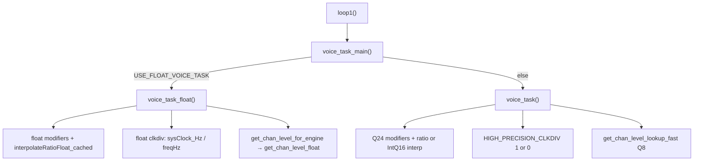

# DCO4_DCO Engine Options (Float vs Fixed-Point)

This firmware can run the real-time voice engine in **float** or **fixed-point** form. The goal is **maximum real-time speed without losing pitch / amplitude precision**. Which path you get depends on compile-time flags at the top of [`DCO4_DCO.ino`](DCO4_DCO.ino).

**Live source of truth for flags:** the “Voice engine build options” block in `DCO4_DCO.ino` (before project includes).  
**Historical migration notes:** [`FIXED_POINT_ANALYSIS.md`](FIXED_POINT_ANALYSIS.md) and [`FIXED_POINT_PLAN.md`](FIXED_POINT_PLAN.md) (archive only — not current flag docs).

---

## 1. Purpose and MCU guidance

| Target | Recommendation | Why |
|--------|----------------|-----|
| **RP2350** (hardware FPU) | Leave `USE_FLOAT_ENGINE` defined | Float pitch / clkdiv / amp-comp is natural and accurate |
| **RP2040** (no FPU) | Comment out / undefine `USE_FLOAT_ENGINE` | Soft-float is expensive; fixed-point hot path was built for this |

**Current checkout default:** `USE_FLOAT_ENGINE` is **defined** (float voice task + float amp-comp).

---

## 2. Quick-pick flag sets

| Goal | What to set |
|------|-------------|
| **Current / FPU (default)** | `#define USE_FLOAT_ENGINE` — leave `PITCH_USE_RATIO_Q16 1` |
| **RP2040 precision** | Undefine `USE_FLOAT_ENGINE`; keep `PITCH_USE_RATIO_Q16 1`; `HIGH_PRECISION_CLKDIV 1` |
| **RP2040 speed** | Same as precision, but `HIGH_PRECISION_CLKDIV 0` (~1 µs/voice clkdiv vs ~4 µs) |
| **Fixed pitch alt (experimental)** | Fixed engine + set `PITCH_USE_RATIO_Q16` to `0` (or undefine), then choose `PITCH_INTERP_USE_Q8`, `PITCH_INTERP_USE_Q12`, or neither (Q20) |

After changing flags: clean rebuild, confirm LittleFS amp-comp tables still load, listen to low notes and amp plateau behaviour.

---

## 3. Master switches

Defined in `DCO4_DCO.ino`:

```text
USE_FLOAT_ENGINE
  ├─ #define USE_FLOAT_VOICE_TASK   // voice_task_float() vs voice_task()
  └─ #define USE_FLOAT_AMP_COMP     // float Hz amp-comp vs Q8 fixed amp-comp
```

| Define | Effect |
|--------|--------|
| `USE_FLOAT_ENGINE` | Master. When defined, forces both derived switches below. |
| `USE_FLOAT_VOICE_TASK` | Compiles `voice_task_float()`; omits fixed `voice_task()`. Enables float portamento state in `voices.h`. |
| `USE_FLOAT_AMP_COMP` | Float Hz amp-comp tables + `precomputeCoefficients_float()` + `get_chan_level_float()`. Changes FS load typing. |

**Mixing:** With the stock cascade you cannot enable float voice + fixed amp-comp (or the reverse) without editing the derived `#ifdef` block by hand. Fixed `voice_task()` calls `get_chan_level_lookup_fast` and needs `!USE_FLOAT_AMP_COMP` — casual mixing will fail to build.

### Dispatch

```text
loop1() → voice_task_main()
            ├─ USE_FLOAT_VOICE_TASK → voice_task_float()
            └─ else                 → voice_task()
```



Related (not engine math, but often used together):

| Define | Default | Role |
|--------|---------|------|
| `RUNNING_AVERAGE` | **on** | Hot-path profiler in [`bench.h`](../bench.h) — see [`BENCHMARKING.md`](BENCHMARKING.md) |
| `DCO_DEBUG_REPORT` | `0` in `voices.ino` | Serial dump of OSC1 frequency stages |
| `ENABLE_FS_CALIBRATION` | on in `globals.h` | Load LittleFS voiceTables / PW cal into amp-comp arrays |
| `CLKDIV_BENCHMARK` | off | **Incomplete** — do not rely on it (see §10) |

---

## 4. Fixed-point pitch pipeline

Active only when `!USE_FLOAT_VOICE_TASK`.

**Flow:**

1. Portamento → current frequency in **Q24 Hz** (`Hz × 2^24`).
2. Sum pitch modifiers in **Q24** (pitch bend, LFO1 FIFO, unison, ADSR→detune, drift, OSC2 detune, epsilon ≈ 1.00001).
3. Scale modifiers × `multiplierTableScale` (10000) into **table-units Q16**.
4. Interpolate pitch-multiplier table → **ratio Q16**.
5. `freq_q24 = (portamento_cur_freq_q24 * ratioQ16) >> 16` (OSC2 also folds detune into the Q16 factor).

### `PITCH_USE_RATIO_Q16` (default: `1`)

| Setting | Hot-path function | Notes |
|---------|-------------------|-------|
| **Nonzero (default)** | `interpolateRatioQ16_cached` | Interpolates table `y` with **`slopeQ20`**, then converts `y → ratio Q16` via reciprocal multiply (`/10000` ≈ `* 0xD1B71759 >> 45`). **Ignores** `PITCH_INTERP_USE_Q8` / `PITCH_INTERP_USE_Q12`. |
| **0 / undefined** | `interpolatePitchMultiplierIntQ16_cached` then reciprocal → ratio Q16 | Slope precision selected by the Q8/Q12 macros below. |

### Pitch interpolator precision (IntQ16 path only)

Used only when `PITCH_USE_RATIO_Q16` is off:

| Mode | Define | Slope storage | Effective precision |
|------|--------|---------------|---------------------|
| Fast | `PITCH_INTERP_USE_Q8` | `slopeQ8` | 16 fractional bits |
| Medium (default if ratio off) | `PITCH_INTERP_USE_Q12` | `slopeQ12` | 24 fractional bits |
| Highest | neither Q8 nor Q12 | `slopeQ20` | Q20 slope × Q16 delta |

**Gotcha:** With the default `PITCH_USE_RATIO_Q16 1`, the Q8/Q12 macros are **inert on the hot path**. Slope arrays for Q8/Q12 may still be built at `initMultiplierTables()` if those macros remain defined.

These flags are `#define`d in `DCO4_DCO.ino` even when `USE_FLOAT_ENGINE` is on (layout is not wrapped in `#ifndef USE_FLOAT_ENGINE`). They only change codegen when the fixed `voice_task()` is compiled.

---

## 5. Fixed-point clock divider

Active only in fixed `voice_task()`. Controlled by `HIGH_PRECISION_CLKDIV` (default **`1`**).

| Value | Math | Code comment |
|-------|------|--------------|
| **1** | 64-bit divide on full **Q24 Hz**: `((sysClock_Hz << 24) + freq_q24/2) / freq_q24` | Preferred accuracy at low Hz; ~**4 µs/voice** |
| **0** | Round to **Q4 Hz** (`freq_q24 >> 20` with rounding), then 32-bit divide | Faster; ~**1 µs/voice** — for aggressive modulation or slower MCUs |

Then OSR chunking / phase-align adjustments produce `clk_div1` / `clk_div2` for the PIO SMs.

**Float path ignores `HIGH_PRECISION_CLKDIV`** and always uses `sysClock_Hz / freqHz` in float.

---

## 6. Float engine pipeline

Active when `USE_FLOAT_VOICE_TASK` is defined.

| Stage | Behaviour |
|-------|-----------|
| Portamento | Separate float state in `voices.h` (`porta_*_f`): TIME = linear Hz; SLEW = linear semitones via `noteIndex_to_freqFloat` |
| Pitch bend / LFO / ADSR / drift | Computed in float; many depths still arrive as Q24 from core 0 / params and are scaled by `1/2^24` each frame |
| Multiplier table | `interpolateRatioFloat_cached` on float table mirrors (`xMultiplierTableF`, `slopeF`) |
| Clkdiv | Always `sysClock_Hz / freqHz` (float), then OSR / phase math |
| Amp-comp | `get_chan_level_for_engine(freqHz, dco)` → `get_chan_level_float` when float amp-comp is on |
| PW | Float intermediates, then integer `get_PW_level_interpolated` (shared) |

**Hard requirement:** float voice task expects `#if PITCH_USE_RATIO_Q16` to be true. The `#else` branch in `voice_task_float()` is a literal `...` stub and **will not compile**. Keep `PITCH_USE_RATIO_Q16 1` when using the float engine.

There are **no** additional float precision `#define`s beyond the master switches.

---

## 7. Amplitude compensation

Gated by `USE_FLOAT_AMP_COMP` (tied to `USE_FLOAT_ENGINE` by default).

Flash format is shared: frequencies stored as **`freq × 100`** (`freq_x100`). Runtime representation diverges after `init_FS()`.

| Mode | After FS load | Precompute | Runtime lookup |
|------|---------------|------------|----------------|
| **Fixed** (`!USE_FLOAT_AMP_COMP`) | `ampCompFrequencyArray` in **Q8 Hz** (`FREQ_FRAC_BITS = 8`), `ampCompArray` as `int32_t` | `precomputeCoefficients()` — windows with `T_FRAC = 12`, `invDxWIN_q28` | `get_chan_level_lookup_fast(xQ8, voiceN)` |
| **Float** (`USE_FLOAT_AMP_COMP`) | `ampCompFrequencyHz` as `float`, `ampCompArray` as `uint16_t` | `precomputeCoefficients_float()` | `get_chan_level_float(freqHz, voiceN)` → `y = (a*x + b)*x + c` |

Shared constants: `ampCompTableSize = 22`, `AMP_COMP_MAX_HZ = 7000`, plateau metadata per oscillator.

`precompute_amp_comp_for_engine()` selects the correct precompute at startup.

**Call-site quirk:** fixed `voice_task()` converts Q24 → Q8 and calls `get_chan_level_lookup_fast` directly. Autotune / debug helpers use `get_chan_level_for_engine` with Hz (facade that picks float or converts for fixed).

**Type footgun:** `ampCompArray` element type changes with amp-comp mode (`int32_t` vs `uint16_t`).

---

## 8. Formats cheat-sheet

| Format | Representation | Typical use |
|--------|----------------|-------------|
| float Hz | `float` | Float voice path; float amp-comp; `sNotePitches[]` |
| Q24 Hz | `int64_t` / `int32_t`, `Hz × 2^24` | Fixed portamento / final freq; LFO/ADSR/pitchbend depths |
| Q16 semitone | `int32_t`, note × `2^16` | Fixed slew portamento |
| Q16 table / ratio | `int32_t` | Pitch table `x`; multiplier ratio after `/10000` |
| Q4 Hz | `uint32_t`, `Hz × 16` | Fast fixed clkdiv (`HIGH_PRECISION_CLKDIV 0`) |
| Q8 Hz | `int32_t`, `Hz × 256` | Fixed amp-comp frequency domain |
| Q12 `t` | `T_FRAC = 12` | Fixed amp-comp quadratic parameter |
| Q20 / Q12 / Q8 slopes | `slopeQ20` / `slopeQ12` / `slopeQ8` | Multiplier table interpolation |
| Q28 reciprocal | `invDxWIN_q28` | Fixed amp-comp `1/dx` |
| `freq_x100` | `int32_t` | FS / calibration storage |
| Table scale | `multiplierTableScale = 10000` | Pitch multiplier tables |

System clock used by clkdiv: `sysClock = 225000` kHz → `sysClock_Hz = 225e6` (`globals.h`).

---

## 9. Shared behaviour (both engines)

- **Core 0 → core 1 FIFO:** LFO1 detune is always transferred as **Q24** (`DETUNE_INTERNAL_q24`). Float path converts each frame.
- **PW PWM:** both engines end in `get_PW_level_interpolated` (integer map using calibrated center/limits).
- **Autotune:** `voice_task_autotune()` uses float-style clkdiv math and `get_chan_level_for_engine`; it is compiled regardless of engine and is not the production note path.
- **Legacy helpers:** `voice_task_simple()` / `voice_task_debug()` may still exist for reference; they are not called from `loop1`. `voice_task_gold_reference()` is **gone** (old docs may still mention it).

---

## 10. Known traps

1. Fixed pitch/clkdiv `#define`s are **not** nested under `#ifndef USE_FLOAT_ENGINE` — they are always present in the `.ino`, but only affect fixed `voice_task()` codegen.
2. Default `PITCH_USE_RATIO_Q16 1` → **Q8/Q12 interpolators unused** on the hot path.
3. Float engine + `PITCH_USE_RATIO_Q16` off → **compile error** (`...` stub).
4. `CLKDIV_BENCHMARK` is unfinished (comment mentions float vs double timing; instrumentation/globals are missing).
5. Do not enable `USE_FLOAT_AMP_COMP` alone while compiling fixed `voice_task()` — missing symbols / wrong types.
6. README / older `REFERENCE_AI` text that says “fully fixed-point / no float in hot path” is obsolete while `USE_FLOAT_ENGINE` is on.
7. Comment typos: `PITCH_INTERP_USE_Q8_` in `.ino` comments; stale “Q18 frequency” / `T_FRAC is 14` remarks in places — trust `T_FRAC = 12` in `amp_comp.h`.

---

## 11. Change checklist

1. Edit flags in `DCO4_DCO.ino` only (before includes).
2. Full rebuild (both cores / clean if IDE caches oddly).
3. Confirm `ENABLE_FS_CALIBRATION` load path matches amp-comp mode (no assert / empty tables).
4. Play low and high notes; check for zippering, beating, or amp dropouts at plateau.
5. Optional: with `RUNNING_AVERAGE` on (default), read the `DCO4 BENCH` USB dump and compare `%win` budgets after a flag change ([`BENCHMARKING.md`](BENCHMARKING.md)).

---

## 12. Where the code lives

| Concern | Files |
|---------|-------|
| Flag definitions | `DCO4_DCO.ino` |
| Dispatch + both voice tasks | `voices.ino` / `voices.h` |
| Amp-comp dual path | `amp_comp.h`, `FS.ino` |
| Note tables | `noteList.h` (`sNotePitches`, `sNotePitches_q24`) |
| Loop call site | `DCO4_DCO.ino` `loop1()` → `voice_task_main()` |
