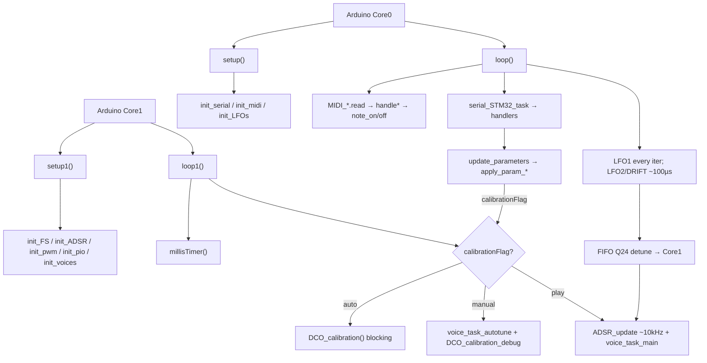

# DCO4_DCO File Index

Purpose of **every file**, and for each source function: **what it does**, **who calls it**, and **when**.

- Deep narrative: [`REFERENCE_AI.md`](REFERENCE_AI.md)
- Engine flags: [`ENGINE_OPTIONS.md`](ENGINE_OPTIONS.md)
- Repo entry / doc index: [`../README.md`](../README.md)

Headers with no bodies are marked **no function definitions**.  
**Dead** = no live callers. **Unreachable** = call site exists but cannot run as currently gated. **`#if 0`** = compiled out.

---

## Call-flow overview

| Context tag | Meaning |
|-------------|---------|
| Framework | Arduino invokes `setup` / `loop` / `setup1` / `loop1` |
| Boot Core0 / Core1 | Inside `setup` / `setup1` |
| Every `loop` / `loop1` | Realtime forever loops |
| MIDI callback | Dispatched from `MIDI_*.read()` in `loop` |
| Serial2 | Parser command on mainboard link |
| Param table | Only via `paramTable[]` / `param_router_apply` |
| Auto-cal / Manual-cal | `loop1` calibration branches |
| Hot path | Inside `voice_task` / `voice_task_float` |

---

## 1. Entry / build / globals

### `DCO4_DCO.ino`

Main sketch: dual-core setup/loops, USB init, engine build flags.

**Functions**
- `setup()` — Core 0 init: serial, MIDI, LFOs, pins, USB strings, cal pin.
  - **Called from:** Arduino framework (Core 0).
  - **When:** Boot once.
- `setup1()` — Core 1 init: PID, FS, ADSR, amp-comp precompute, PWM, PIO, voices; clears cal flags.
  - **Called from:** Arduino framework (Core 1).
  - **When:** Boot once. (`init_DCO_calibration` block below is unreachable — see that function.)
- `loop()` — Core 0: MIDI read, Serial2 pump, LFO1; ~100 µs LFO2 + drift + FIFO push; `bench_poll_core0()`.
  - **Called from:** Arduino framework (Core 0).
  - **When:** Forever.
- `loop1()` — Core 1: `millisTimer`; auto/manual cal **or** ADSR + FIFO pop + `voice_task_main`; `bench_service(1)`.
  - **Called from:** Arduino framework (Core 1).
  - **When:** Forever.

**Key macros:** `RUNNING_AVERAGE` (default on), `USE_FLOAT_ENGINE`, `USE_FLOAT_VOICE_TASK`, `USE_FLOAT_AMP_COMP`, `PITCH_USE_RATIO_Q16`, `PITCH_INTERP_USE_Q*`, `HIGH_PRECISION_CLKDIV`.

### `bench.h`

SysTick hot-path profiler: probe table, cross-core snapshot, paced USB report. See [`BENCHMARKING.md`](BENCHMARKING.md).

**Functions**
- `bench_init_core()` — Arm this core's SysTick; calibrate probe overhead.
  - **Called from:** `setup()`, `setup1()`.
- `bench_poll_core0()` — Periodic ~1 Hz dump request, format report, pace Serial TX.
  - **Called from:** `loop()`.
- `bench_service()` — Snapshot and clear this core's probes on dump request.
  - **Called from:** `bench_poll_core0()` (core 0); `loop1()` (core 1).

### `include_all.h`

Umbrella include. **No function definitions.**

### `globals.h`

Shared constants, pins, state, prototypes. **No function definitions.**

### `tusb_config.h`

TinyUSB `#define`s. **No function definitions.**

### `usb_descriptors.c`

Legacy descriptors — fully commented. **No active function definitions.**

---

## 2. Voice / oscillator / PWM path

### `voices.h`

Declarations / portamento & table state. **No function definitions.**

### `voices.ino`

Real-time voice engine (float/fixed), allocation, pitch tables, amp/PW helpers.

**Functions**
- `init_voices()` — Initial notes, tables, voice mode, first `voice_task_main()`.
  - **Called from:** `setup1()`.
  - **When:** Boot Core1.
- `noteQ16_to_freqQ24()` — Q16 semitone → Q24 Hz.
  - **Called from:** `voice_task()` (slew portamento).
  - **When:** Fixed hot path.
- `float_to_q24()` — Float → Q24.
  - **Called from:** **none (dead)** — defined but unused.
- `noteIndex_to_freqFloat()` — Float note index → Hz.
  - **Called from:** `voice_task_float()` (portamento).
  - **When:** Float hot path.
- `voice_task_main()` — Dispatch to float or fixed voice task.
  - **Called from:** `loop1()` (play path); `init_voices()` (boot kick).
  - **When:** Every play-path `loop1` iter + once at boot.
- `voice_task()` — Fixed-point hot path.
  - **Called from:** `voice_task_main()` when `!USE_FLOAT_VOICE_TASK`.
  - **When:** Fixed-engine builds only.
- `voice_task_float()` — Float hot path (current default).
  - **Called from:** `voice_task_main()` when `USE_FLOAT_VOICE_TASK`.
  - **When:** Every play-path `loop1` iter (current checkout).
- `voice_task_simple()` — Legacy simplified float path.
  - **Called from:** **none (dead)** — call in `loop1` is commented out.
- `voice_task_debug()` — Debug float path.
  - **Called from:** **none (dead)** — call in `loop1` is commented out.
- `voice_task_autotune()` — Drive one osc for calibration measurement.
  - **Called from:** `loop1()` (manual cal); `measure_gap_for_amp` / PW & freq search helpers in `PID.ino` / `autotune.ino`; unreachable call in `setup1`.
  - **When:** Manual-cal every `loop1`; nested during auto-cal measurements.
- `get_free_voice_sequential()` — Round-robin free voice.
  - **Called from:** `note_on()` when `polyMode == 1`.
  - **When:** MIDI note-on.
- `get_free_voice()` — Oldest/steal free voice.
  - **Called from:** `note_on()` when `polyMode == 0`.
  - **When:** MIDI note-on.
- `setVoiceMode()` — Apply `voiceMode` → `NUM_VOICES` / `STACK_VOICES`.
  - **Called from:** `init_voices()`; `apply_param_voice_mode()`.
  - **When:** Boot; Serial2 param.
- `setSyncMode()` — Reconfigure PIO sync sidesets; retrigger.
  - **Called from:** `apply_param_sync_mode()`.
  - **When:** Serial2 param.
- `get_chan_level_lookup_fast()` — Q8 Hz → range PWM (fixed amp-comp).
  - **Called from:** `voice_task()` directly; `get_chan_level_for_engine()` when fixed amp-comp.
  - **When:** Fixed hot path / facade.
- `get_chan_level_float()` — Hz → range PWM (float amp-comp).
  - **Called from:** `get_chan_level_for_engine()` when `USE_FLOAT_AMP_COMP`.
  - **When:** Float amp-comp path.
- `get_PW_level_interpolated()` — Map PW counter into calibrated limits/center.
  - **Called from:** `voice_task()` / `voice_task_float()` (99 µs PW update).
  - **When:** Hot path.
- `interpolatePitchMultiplierIntQ16_cached()` — IntQ16 table interp (Q8/Q12/Q20).
  - **Called from:** `voice_task()` when `PITCH_USE_RATIO_Q16` is off.
  - **When:** Fixed hot path, non-default pitch mode.
- `interpolateRatioQ16_cached()` — Table → ratio Q16.
  - **Called from:** `voice_task()` when `PITCH_USE_RATIO_Q16`.
  - **When:** Fixed hot path (default fixed pitch mode).
- `interpolateRatioFloat_cached()` — Table → float ratio.
  - **Called from:** `voice_task_float()` when `PITCH_USE_RATIO_Q16`.
  - **When:** Float hot path.
- `initMultiplierTables()` — Build int/float pitch tables and slopes (uses `expInterpolationSolveY`).
  - **Called from:** `init_voices()`.
  - **When:** Boot Core1.
- `print_clkdiv_bench()` — Append CLKDIV comparison to report (stub on DCO4).
  - **Called from:** `bench_poll_core0()`.
  - **When:** `CLKDIV_BENCHMARK` (not wired).

### `noteList.h`

Note → frequency tables. **No function definitions.**

### `state_machines.h`

Prototypes. **No function definitions.**

### `state_machines.ino`

PIO load and SM setup.

**Functions**
- `init_pio()` — Load PIO program; `start_voice_sms()`.
  - **Called from:** `setup1()`.
  - **When:** Boot Core1.
- `start_voice_sms()` — Per-DCO `init_sm_sync` + preload pulse length.
  - **Called from:** `init_pio()`.
  - **When:** Boot.
- `init_sm()` — Basic SM init via `init_sm_pin`.
  - **Called from:** **none (dead)** — live path uses `init_sm_sync`.
- `init_sm_sync()` — Production SM init via `frequency_sync_4_jumps`.
  - **Called from:** `start_voice_sms()`.
  - **When:** Boot.
- `set_frequency()` — Simple test frequency setter.
  - **Called from:** **none (dead)**.

### `pico-dco.pio`

PIO assembly source. **Not C functions.**

### `pico-dco.pio.h`

Generated PIO C wrappers.

**Functions**
- `frequency_program_get_default_config()` — Default config for basic frequency program.
  - **Called from:** `init_sm_pin()`.
  - **When:** Only if `init_sm` path used (currently dead).
- `init_sm_pin()` — Init SM for basic frequency program.
  - **Called from:** `init_sm()`.
  - **When:** Dead path today.
- `frequency_sync_program_get_default_config()` — Default config for sync program.
  - **Called from:** `frequency_sync()`.
  - **When:** Only if that init used (**dead** — not called from project code).
- `frequency_sync()` — Init SM for older sync program.
  - **Called from:** **none (dead)** — production uses `frequency_sync_4_jumps`.
- `frequency_sync_4_jumps_program_get_default_config()` — Default config for production program.
  - **Called from:** `frequency_sync_4_jumps()`.
  - **When:** Boot SM init.
- `frequency_sync_4_jumps()` — Init SM for production 4-jump sync program.
  - **Called from:** `init_sm_sync()`.
  - **When:** Boot.
- `frequency_pulse1_program_get_default_config()` — Default config for pulse1 program.
  - **Called from:** `frequency_pulse1_program_init()`.
  - **When:** Only if pulse1 init used.
- `frequency_pulse1_program_init()` — Init SM for pulse1 program.
  - **Called from:** **none (dead)** in this firmware.

### `PWM.h`

Prototype. **No function definitions.**

### `PWM.ino`

**Functions**
- `init_pwm()` — Configure range + PW PWM slices.
  - **Called from:** `setup1()`.
  - **When:** Boot Core1.

### `amp_comp.h`

Amp-comp tables + dual-engine precompute/facade.

**Functions**
- `precomputeCoefficients()` — Fixed Q-window precompute.
  - **Called from:** `precompute_amp_comp_for_engine()` when `!USE_FLOAT_AMP_COMP`.
  - **When:** Boot / after auto-cal reload.
- `precomputeCoefficients_float()` — Float Hz quadratic precompute.
  - **Called from:** `precompute_amp_comp_for_engine()` when `USE_FLOAT_AMP_COMP`.
  - **When:** Boot / after auto-cal reload.
- `precompute_amp_comp_for_engine()` — Dispatch to float or fixed precompute.
  - **Called from:** `setup1()`; end of `DCO_calibration()`.
  - **When:** Boot Core1; end of auto-cal.
- `get_chan_level_for_engine()` — Hz → PWM via float or Q8 lookup.
  - **Called from:** `voice_task_float()`, `voice_task_simple/debug`, `voice_task_autotune()`.
  - **When:** Float play path / cal / dead debug paths.

---

## 3. Modulation (ADSR / LFO)

### `adsr.h`

Globals / instances. **No function definitions.**

### `adsr.ino`

**Functions**
- `init_ADSR()` — Tables + initial A/D/S/R (uses `linearToLogarithmic`).
  - **Called from:** `setup1()`.
  - **When:** Boot Core1.
- `ADSR_update()` — Advance envelopes from note flags; update levels; lazy params.
  - **Called from:** `loop1()` play path when `(micros delta) > 100`.
  - **When:** ~10 kHz while playing.
- `ADSR_set_parameters()` — Debounced A/D/S/R apply to all voices.
  - **Called from:** `ADSR_update()`.
  - **When:** Nested in ADSR update.
- `ADSR1_set_restart()` — Set restart/legato mode on all voices.
  - **Called from:** **none (dead)**.
- `ADSR1_change_curves()` — Re-apply after curve change.
  - **Called from:** **none (dead)**.

### `LFO.h`

Prototypes / instances. **No function definitions.**

### `LFO.ino`

**Functions**
- `init_LFOs()` — Init LFO1 + LFO2.
  - **Called from:** `setup()`.
  - **When:** Boot Core0.
- `init_LFO1()` — Configure main detune LFO.
  - **Called from:** `init_LFOs()`.
  - **When:** Boot.
- `init_LFO2()` — Configure secondary LFO.
  - **Called from:** `init_LFOs()`.
  - **When:** Boot.
- `init_DRIFT_LFOs()` — Init all drift LFOs.
  - **Called from:** `setup()`.
  - **When:** Boot Core0.
- `init_DRIFT_LFO()` — Init one drift LFO (uses `expConverterFloat`).
  - **Called from:** `init_DRIFT_LFOs()`; also re-speed from param applies.
  - **When:** Boot; Serial2 drift params.
- `LFO1()` — Update LFO1 → `DETUNE_INTERNAL_q24`.
  - **Called from:** `loop()` every iteration.
  - **When:** Realtime Core0.
- `LFO2()` — Update LFO2 depths.
  - **Called from:** `loop()` when ~100 µs elapsed.
  - **When:** Realtime Core0.
- `DRIFT_LFOs()` — Update `LFO_DRIFT_LEVEL[]`.
  - **Called from:** `loop()` when ~100 µs elapsed (with LFO2).
  - **When:** Realtime Core0.

---

## 4. Calibration / storage / experimental

### `autotune.h`

Globals / types / prototypes. **No function definitions.**

### `autotune_constants.h`

Constants only. **No function definitions.**

### `autotune_context.h`

**Functions**
- `DCOCalibrationContext::DCOCalibrationContext(...)` — Bind refs for `calibrate_DCO`.
  - **Called from:** `DCO_calibration()` when constructing context.
  - **When:** Auto-cal per oscillator.

### `autotune_measurement.h`

**Functions**
- `measure_gap()` — Wrap `find_gap()` with timeout flag.
  - **Called from:** PW search in `autotune.ino`; `measure_gap_for_amp`, `find_highest_freq`, `find_lowest_freq`, `DCO_calibration_debug`.
  - **When:** Auto-cal / manual-cal measurement.

### `autotune.ino`

**Functions**
- `disable_all_oscillators_and_range_pwm()` — Mute oscs / zero range PWM (calls `reset_even_pw_to_DIV_COUNTER_PW`).
  - **Called from:** `init_DCO_calibration()`, `DCO_calibration()`, `restart_DCO_calibration()`.
  - **When:** Cal setup (note `init_DCO_calibration` unreachable at boot).
- `reset_even_pw_to_center()` — PW → stored center.
  - **Called from:** **none (dead)**.
- `reset_even_pw_to_0()` — PW → 0.
  - **Called from:** **none (dead)**.
- `reset_even_pw_to_DIV_COUNTER_PW()` — PW → max wrap.
  - **Called from:** `disable_all_oscillators_and_range_pwm()`.
  - **When:** Cal setup.
- `reset_even_pw_to_mid_point()` — PW → mid wrap.
  - **Called from:** **none (dead)**.
- `init_DCO_calibration()` — Legacy/boot cal kickoff.
  - **Called from:** `setup1()` only if `calibrationFlag` — but flag is set `false` just above → **unreachable**.
  - **When:** Would be boot; currently never.
- `DCO_calibration()` — Full auto-cal: PW center/limits, `calibrate_DCO`, FS write, reload, precompute; clears `calibrationFlag`.
  - **Called from:** `loop1()` when `calibrationFlag && !manualCalibrationFlag`.
  - **When:** Auto-cal (blocking one-shot).
- `restart_DCO_calibration()` — Reset state between oscillators.
  - **Called from:** `DCO_calibration()` per osc.
  - **When:** Auto-cal.
- `find_PW_for_target_duty()` — Search PW for target duty.
  - **Called from:** `find_PW_center()`.
  - **When:** Auto-cal PW stage.
- `find_PW_center()` — Find ~50% PW center; `update_FS_PWCenter`.
  - **Called from:** `DCO_calibration()` (even DCOs).
  - **When:** Auto-cal.
- `search_PW_limit_from_center()` — Walk PW toward low/high duty limit.
  - **Called from:** `find_PW_limit_v2()`.
  - **When:** Auto-cal.
- `find_PW_limit_v2()` — High-level PW limit; persist low/high via FS.
  - **Called from:** `DCO_calibration()` (LOW then HIGH).
  - **When:** Auto-cal.
- `find_gap()` — Edge-time duty/freq measurement on cal pin.
  - **Called from:** `measure_gap()`; also direct inside `#if 0` legacy PID.
  - **When:** Cal measurement (live via wrapper).
- `DCO_calibration_debug()` — Live gap → `serialSendParam32` for UI.
  - **Called from:** `loop1()` manual-cal branch every iter.
  - **When:** Manual-cal.

### `PID.h`

Globals / prototypes. **No function definitions.**

### `PID.ino`

**Functions**
- `compute_gap_tolerance_for_freq()` — Duty tolerance vs frequency.
  - **Called from:** `calibrate_DCO()`; `find_PW_center()` (via same helper visibility).
  - **When:** Auto-cal.
- `did_sign_change()` — Detect gap error sign flip.
  - **Called from:** `calibrate_DCO()`.
  - **When:** Auto-cal amp search.
- `measure_gap_for_amp()` — Set amp PWM, `voice_task_autotune`, `measure_gap`.
  - **Called from:** `calibrate_DCO()`.
  - **When:** Auto-cal.
- `update_best_from_neighbours()` — Probe neighbour amps; keep best.
  - **Called from:** `calibrate_DCO()`.
  - **When:** Auto-cal.
- `step_amp_from_error()` — Step range PWM from signed error.
  - **Called from:** `calibrate_DCO()`.
  - **When:** Auto-cal.
- `compute_initial_amp_for_note()` — Initial amp guess (uses log/quadratic interp).
  - **Called from:** `calibrate_DCO()`.
  - **When:** Auto-cal.
- `store_note_result()` — Write `[freq,pwm]` into `calibrationData`.
  - **Called from:** `calibrate_DCO()`.
  - **When:** Auto-cal per note.
- `init_PID()` — Init `PID_v1` object/mode.
  - **Called from:** `setup1()`.
  - **When:** Boot (PID still inited even though main cal no longer uses it).
- `PID_dco_calibration()` — Legacy PID note loop.
  - **Called from:** **`#if 0` (compiled out)**.
- `PID_find_highest_freq()` — Legacy PID highest-freq helper.
  - **Called from:** **`#if 0` (compiled out)**.
- `find_highest_freq()` — Search highest usable freq (Hz×100).
  - **Called from:** `calibrate_DCO()`.
  - **When:** Auto-cal span setup.
- `find_lowest_freq()` — Search lowest usable freq (uses `linearInterpolation` / quadratic).
  - **Called from:** `calibrate_DCO()`.
  - **When:** Auto-cal span setup.
- `calibrate_DCO()` — Main per-note amp-table builder.
  - **Called from:** `DCO_calibration()`.
  - **When:** Auto-cal.
- `quadraticInterpolation()` — 3-point quadratic `y(x)`.
  - **Called from:** `compute_initial_amp_for_note()`; `find_lowest_freq()`.
  - **When:** Auto-cal.
- `exponentialInterpolation()` — Exp interpolate → uint16.
  - **Called from:** **none (dead)**.
- `logarithmicInterpolation()` — Log interpolate → uint16.
  - **Called from:** `compute_initial_amp_for_note()`.
  - **When:** Auto-cal.
- `logarithmicInterpolationFloat()` — Log interpolate float.
  - **Called from:** **none (dead)**.
- `logarithmicInterpolationDouble()` — Log interpolate double.
  - **Called from:** **none (dead)**.
- `linearInterpolation()` — Linear interpolate.
  - **Called from:** `find_lowest_freq()`.
  - **When:** Auto-cal.
- `expInterpolationSolveY()` — Solve exp curve for table building.
  - **Called from:** `initMultiplierTables()`.
  - **When:** Boot (pitch tables), not cal.

### `FS.h`

Constants / buffers. **No function definitions.**

### `FS.ino`

**Functions**
- `init_FS()` — Mount LittleFS; load tables into float or Q8 arrays.
  - **Called from:** `setup1()`; end of `DCO_calibration()`.
  - **When:** Boot; after auto-cal write.
- `update_FS_voice()` — Persist one osc amp table.
  - **Called from:** `DCO_calibration()` per osc.
  - **When:** Auto-cal.
- `update_FS_PWCenter()` — Persist PW center.
  - **Called from:** `find_PW_center()`.
  - **When:** Auto-cal.
- `update_FS_PW_High_Limit()` — Persist PW high limit.
  - **Called from:** `find_PW_limit_v2()`.
  - **When:** Auto-cal.
- `update_FS_PW_Low_Limit()` — Persist PW low limit.
  - **Called from:** `find_PW_limit_v2()`.
  - **When:** Auto-cal.
- `update_FS_ManualCalibrationOffset()` — Persist manual offset.
  - **Called from:** `apply_param_manual_calibration_store()`.
  - **When:** Serial2 param (user store).

### `irq_tuner.h` / `irq_tuner.ino`

Experimental; bodies commented. **No active function definitions.**

---

## 5. MIDI, serial, parameters

### `midi.h`

Prototypes / instances. **No function definitions.**

### `midi.ino`

**Functions**
- `init_midi()` — Register handlers on USB + Serial1 MIDI.
  - **Called from:** `setup()`.
  - **When:** Boot Core0.
- `handleNoteOn()` — → `note_on()`.
  - **Called from:** MIDI library (registered in `init_midi`).
  - **When:** MIDI callback from `loop` `.read()`.
- `handleNoteOff()` — → `note_off()`.
  - **Called from:** MIDI library.
  - **When:** MIDI callback.
- `handleControlChange()` — e.g. CC 42 → pitch-bend range / Q24 multiplier.
  - **Called from:** MIDI library.
  - **When:** MIDI callback.
- `handleProgramChange()` — Stub / empty as implemented.
  - **Called from:** MIDI library.
  - **When:** MIDI callback.
- `handlePitchBend()` — Sets `midi_pitch_bend`.
  - **Called from:** MIDI library.
  - **When:** MIDI callback.
- `note_on()` — Allocate voice(s), set ADSR/note flags, `serial_send_note_on`.
  - **Called from:** `handleNoteOn()`.
  - **When:** MIDI note-on.
- `note_off()` — Release voice(s), flags, `serial_send_note_off`.
  - **Called from:** `handleNoteOff()`.
  - **When:** MIDI note-off.

### `Serial.h`

Prototype. **No function definitions.**

### `Serial.ino`

**Functions**
- `init_serial()` — Serial1 MIDI baud, Serial2 2.5M, USB CDC.
  - **Called from:** `setup()`.
  - **When:** Boot Core0.
- `dco_handle_pw_update()` — `'f'` → `PW[]`.
  - **Called from:** Serial2 parser command table.
  - **When:** Serial2 RX.
- `dco_handle_adsr_block()` — `'s'` → ADSR1 A/D/S/R globals.
  - **Called from:** Serial2 parser.
  - **When:** Serial2 RX.
- `dco_handle_param16()` — `'p'` → `update_parameters`.
  - **Called from:** Serial2 parser.
  - **When:** Serial2 RX.
- `dco_handle_param8()` — `'w'` → `update_parameters`.
  - **Called from:** Serial2 parser.
  - **When:** Serial2 RX.
- `dco_handle_param32()` — `'x'` → `update_parameters`.
  - **Called from:** Serial2 parser.
  - **When:** Serial2 RX.
- `serial_STM32_task()` — Non-blocking parser pump (`serial_parser_*`).
  - **Called from:** `loop()` every iteration.
  - **When:** Realtime Core0.
- `serial_send_note_on()` — TX `'n'` to mainboard.
  - **Called from:** `note_on()`.
  - **When:** MIDI note-on.
- `serial_send_note_off()` — TX `'o'` to mainboard.
  - **Called from:** `note_off()`.
  - **When:** MIDI note-off.
- `serial_send_generaldata()` — Generic 16-bit TX helper.
  - **Called from:** **none (dead)**.
- `serialSendParam32()` — TX `'x'` param32 upstream.
  - **Called from:** `apply_param_manual_calibration_flag()`; `DCO_calibration_debug()`.
  - **When:** Manual-cal param / live gap report.

### `serial_protocol.h`

**Functions**
- `serial_protocol_payload_len()` — Command → payload length.
  - **Called from:** **none (dead)** — lengths hardcoded in `dcoSerial2Commands[]`.

### `serial_param_protocol.h`

**Functions**
- `decode_i16_be()` — BE int16 decode.
  - **Called from:** `decode_param_p()`.
  - **When:** Serial2 param decode.
- `decode_i32_le()` — LE int32 decode.
  - **Called from:** `decode_param_x()`.
  - **When:** Serial2 param decode.
- `decode_param_p()` — Decode `'p'` frame.
  - **Called from:** `dco_handle_param16()`.
  - **When:** Serial2.
- `decode_param_w()` — Decode `'w'` frame.
  - **Called from:** `dco_handle_param8()`.
  - **When:** Serial2.
- `decode_param_x()` — Decode `'x'` frame.
  - **Called from:** `dco_handle_param32()`.
  - **When:** Serial2.

### `serial_parser.h`

**Functions**
- `serial_parser_reset()` — Reset parser to idle.
  - **Called from:** `serial_parser_process_byte` / timeout path.
  - **When:** Serial2 parsing.
- `serial_parser_find_cmd()` — Lookup command in table.
  - **Called from:** `serial_parser_process_byte()`.
  - **When:** Serial2 parsing.
- `serial_parser_check_timeout()` — Abort partial frame.
  - **Called from:** `serial_STM32_task()` while in payload state.
  - **When:** Every `loop` during RX.
- `serial_parser_process_byte()` — Feed one byte; invoke handler when complete.
  - **Called from:** `serial_STM32_task()`.
  - **When:** Every available Serial2 byte.

### `params_def.h`

`enum ParamId` only. **No function definitions.**

### `param_router.h`

**Functions**
- `param_router_apply()` — Table lookup ParamId → apply callback.
  - **Called from:** `update_parameters()`.
  - **When:** Serial2 param frames.

### `params.ino`

**Functions**
- `update_parameters()` — Route param id/value through `paramTable`.
  - **Called from:** `dco_handle_param16/8/32()`.
  - **When:** Serial2 `'p'/'w'/'x'`.
- All `apply_param_*()` below — **Called from:** **param table only** (never direct). **When:** matching Serial2 ParamId.

- `apply_param_sqr1_status()` — OSC1 square/wave status.
- `apply_param_adsr3_to_osc_select()` — ADSR3 routing select.
- `apply_param_lfo1_waveform()` — LFO1 waveform.
- `apply_param_lfo2_waveform()` — LFO2 waveform.
- `apply_param_osc1_interval()` — OSC1 interval.
- `apply_param_osc2_interval()` — OSC2 interval.
- `apply_param_osc2_detune_val()` — OSC2 detune.
- `apply_param_lfo2_to_detune2()` — LFO2→OSC2 detune depth (uses `expConverterFloat`).
- `apply_param_osc_sync_mode()` — Osc sync / phase-align related.
- `apply_param_portamento_time()` — Porta time (uses `expConverter`).
- `apply_param_portamento_mode()` — Time vs slew porta.
- `apply_param_calibration_value()` — Reserved / no-op.
- `apply_param_voice_mode()` — → `setVoiceMode()`.
- `apply_param_unison_detune()` — Unison amount.
- `apply_param_analog_drift_amount()` — Drift depth.
- `apply_param_analog_drift_speed()` — Drift speed (recomputes via `expConverterFloat`).
- `apply_param_analog_drift_spread()` — Drift spread (recomputes speeds).
- `apply_param_sync_mode()` — → `setSyncMode()`.
- `apply_param_lfo1_to_dco()` — LFO1→DCO depth (`expConverterFloat`).
- `apply_param_lfo1_speed()` — LFO1 rate.
- `apply_param_lfo2_speed()` — LFO2 rate.
- `apply_param_lfo2_to_pw()` — LFO2→PW depth.
- `apply_param_adsr1_to_pwm()` — ADSR→PWM depth (`PARAM_ADSR3_TO_PWM`).
- `apply_param_adsr1_to_detune1()` — ADSR→detune + Q24 scale.
- `apply_param_adsr1_curve()` — Attack curve hook (light/reserved).
- `apply_param_adsr2_curve()` — Decay curve hook (light/reserved).
- `apply_param_pwm_pots_manual()` — Manual PWM pots flag.
- `apply_param_function_key()` — Function key (reserved/no-op).
- `apply_param_calibration_flag()` — Sets `calibrationFlag` → next `loop1` auto-cal.
- `apply_param_manual_calibration_flag()` — Manual cal mode; may `serialSendParam32` offsets.
- `apply_param_manual_calibration_stage()` — Manual cal stage index.
- `apply_param_manual_calibration_offset()` — Per-osc manual offset.
- `apply_param_manual_calibration_store()` — → `update_FS_ManualCalibrationOffset`.

---

## 6. Timing / utilities

### `Timer_millis.h`

Flags only. **No function definitions.**

### `Timer_millis.ino`

**Functions**
- `millisTimer()` — Update soft timer flags (99 µs, ~1 ms, 200 ms, 1000 ms, …).
  - **Called from:** `loop1()` every iteration.
  - **When:** Realtime Core1. (`timer99microsFlag` used in voice PW update.)

### `utils.h`

Prototypes. **No function definitions.**

### `utils.ino`

**Functions**
- `uintToStr()` — uint64 → C string.
  - **Called from:** **none (dead)** — only commented use in `irq_tuner.ino`.
- `linearToLogarithmic()` — Linear → log map.
  - **Called from:** `init_ADSR()`.
  - **When:** Boot.
- `linearToExponential()` — Linear → exp map.
  - **Called from:** **none (dead)**.
- `faderExpConverter()` — Fader exp curve.
  - **Called from:** **none (dead)**.
- `expConverterFloat()` — Exp curve → float.
  - **Called from:** `params.ino` applies; `init_DRIFT_LFO()`; also inside dead `controls_formula_update`.
  - **When:** Serial2 params; boot drift init.
- `expConverter()` — Exp curve → uint16.
  - **Called from:** `apply_param_portamento_time()`.
  - **When:** Serial2 param.
- `expConverterReverse()` — Inverse exp.
  - **Called from:** **none (dead)**.
- `expConverterFloatReverse()` — Inverse float exp.
  - **Called from:** **none (dead)**.
- `expConverter2()` — Alternate exp curve.
  - **Called from:** **none (dead)**.
- `formula_update()` — Legacy formula slot update.
  - **Called from:** **none (dead)**.
- `controls_formula_update()` — Map controls to float params.
  - **Called from:** **none (dead)**.
- `led_blinking_task()` — LED heartbeat.
  - **Called from:** **none (dead)** — declared in `globals.h` but never called.

---

## 7. Documentation

All detailed docs live under `docs/` (this file included). Root `README.md` is the entry point.

| File | Purpose |
|------|---------|
| `README.md` (repo root) | Overview, build, documentation index. |
| `docs/DOCUMENTATION_PROCEDURE.md` | Reusable phased guide to document any DCO4 board. |
| `docs/SYSTEM_OVERVIEW.md` | Four-board system / UART topology. |
| `docs/ENGINE_OPTIONS.md` | Float/fixed engine flags. |
| `docs/REFERENCE_AI.md` | Deep semantic map. |
| `docs/FILE_INDEX.md` | This file — files, functions, call sites. |
| `docs/README_serial_and_params.md` | Shared serial / ParamId how-to. |
| `docs/Serial_comms_and_params_reference.txt` | Earlier design notes (partially historical). |
| `docs/AUTOTUNE.md` | Autotune algorithms. |
| `docs/AUTOTUNE_REFACTORED.md` | Autotune refactor structure. |
| `docs/FIXED_POINT_ANALYSIS.md` | **Archive** |
| `docs/FIXED_POINT_PLAN.md` | **Archive** |

---

## 8. Other / non-active

| File | Purpose |
|------|---------|
| `params.ino.backup_old_version` | Old params backup; not compiled. |
| `.gitignore` | Ignores editor/local clutter. |

---

## 9. External libraries (not in this repo)

| Library | Used by |
|---------|---------|
| `ADSR_Bezier` | `adsr.*` |
| `mo-lfo` | `LFO.*` |
| `PID_v1` | `PID.*` / `init_PID` |
| Adafruit TinyUSB | USB MIDI |
| MIDI (FortySevenEffects) | `midi.*` (calls `handle*`) |
| LittleFS (RP2040 core) | `FS.*` |

---

## Quick “where do I change X?”

| Goal | Start here |
|------|------------|
| Engine float/fixed | `DCO4_DCO.ino` flags → `voice_task_main` |
| New ParamId | `params_def.h` → `params.ino` table (only call path) |
| Serial command | `serial_protocol.h` + `Serial.ino` handlers ← `serial_STM32_task` in `loop` |
| Start auto-cal | Param → `apply_param_calibration_flag` → `loop1` → `DCO_calibration` |
| Manual cal UI | `apply_param_manual_calibration_*` → `loop1` manual branch |
| MIDI notes | `loop` → MIDI `.read` → `note_on`/`note_off` → Serial2 `'n'/'o'` |
| Play audio path | `loop1` → `ADSR_update` + `voice_task_main` |
